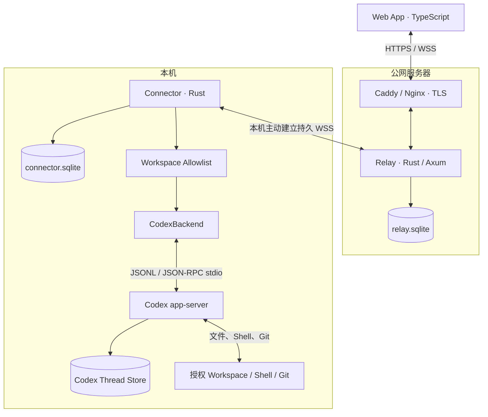

# BridgeHub V1 系统设计

- 状态：已完成讨论，等待文档复核
- 日期：2026-07-18
- 受众：项目实现者、维护者和后续接手的 Agent

## 1. 摘要

BridgeHub 是一个个人 Agent 网关。用户从公网浏览器连接自有服务器，再由本机 Connector 调用 Codex app-server，使用户可以在任何网络下安全地操作本机编码 Agent。

BridgeHub 不自行实现模型调用、Agent Loop、上下文压缩或 Tool Calling。Codex 继续拥有这些能力；BridgeHub 负责认证、路由、Workspace 限制、Session 映射、实时事件、审批、停止、断线恢复和 Web 交互。

V1 的成功标准是完成以下闭环：

```text
公网 Web 输入
  → Public Relay
  → Local Connector
  → Codex app-server
  → 本机 Workspace / Shell / Git
  → 流式事件与审批原路返回 Web
```

## 2. 背景与目标

### 2.1 学习目标

项目用于系统学习以下主题：

- Rust Workspace、Trait、错误分层和强类型协议。
- Tokio Task、Channel、Actor、取消、背压和进程监督。
- WebSocket、HTTP、认证与反向代理。
- SQLite 状态持久化、迁移和崩溃恢复。
- 子进程 JSONL/JSON-RPC 双向通信。
- Agent Session、Turn、Item、Tool Event 与 Approval 生命周期。
- React/TypeScript 流式状态管理与端到端测试。

学习深度来自真实的责任边界、故障处理和测试，不通过堆叠无实际责任的框架或抽象层实现。

### 2.2 产品目标

V1 必须支持：

- 单用户通过 HTTPS/WSS 登录自有公网服务器。
- 查看本机 Connector 在线状态。
- 选择 Connector 预先授权的 Workspace。
- 创建、列出和恢复 Codex Session。
- 多轮文本对话和流式 Agent 输出。
- 展示命令执行与文件修改事件。
- 展示并处理 Codex 的批准、拒绝等决策。
- 中断活动 Turn。
- 浏览器和 Relay 断线后的状态恢复。
- Connector/Codex 异常时的明确降级和恢复提示。

### 2.3 V1 非目标

- 重新实现 Codex、Claude Code 或 OpenClaw。
- 解析 PTY/ANSI 终端界面作为稳定协议。
- Claude Code、OpenClaw 或其他 Agent Backend。
- 录音、图片和文档上传。
- 多用户、RBAC、组织管理和共享 Workspace。
- 完整终端、文件管理器、Git 面板和原生移动端。
- Relay 高可用、跨区域部署和端到端加密。

## 3. 现有方案检查与自建理由

Kanna、YepAnywhere、HAPI 和 Paseo 等项目已经覆盖部分“远程访问本地编码 Agent”需求。若目标只是尽快投入生产使用，应优先评估这些项目：

- Kanna：https://github.com/jakemor/kanna
- YepAnywhere：https://github.com/kzahel/yepanywhere
- HAPI：https://github.com/tiann/hapi
- Paseo：https://github.com/getpaseo/paseo

BridgeHub 仍选择自建，因为主要目标是理解 Agent Harness、双向协议、并发、状态恢复和安全边界。自建实现不会复制 Codex 已经拥有的 Agent Loop，而是聚焦这些项目未必以教学方式暴露的网关层。

## 4. 总体架构



### 4.1 Web App

Web App 负责：

- 登录和设备在线状态。
- Workspace 与 Session 选择。
- 创建、恢复和展示 Session。
- 流式渲染 Agent 消息、命令和文件修改。
- 展示审批选择和 Stop 操作。

Web App 不直接访问本机路径，不拥有 Agent Session 真相，不在 V1 持久化 transcript。

### 4.2 Public Relay

Relay 负责：

- Human 与 Device 身份认证。
- WebSocket 连接和协议版本协商。
- 设备在线状态与 Session 路由。
- 有界的短暂内存事件缓冲。
- 提供 Web 静态资源和有限 HTTP API。
- 持久化设备和 Session 路由元数据。

Relay 不运行 Agent，不执行 Shell，不持久化聊天正文、命令输出或 diff。

### 4.3 Local Connector

Connector 负责：

- 主动连接 Relay；本机不开放公网入站端口。
- 心跳、断线重连和协议握手。
- Workspace Allowlist 与 `workspace_id` 映射。
- Codex app-server 子进程启动、初始化、监控和重启。
- 公共 Session 与 Codex Thread 的映射。
- Session Actor、事件序号、活动 Turn 和审批状态。
- BridgeHub 协议与 `AgentBackend` 领域操作之间的转换。

### 4.4 CodexBackend 与 Codex app-server

CodexBackend 是 V1 唯一后端，实现统一的 `AgentBackend` 接口。它负责：

- 逐行读写 JSONL。
- 关联 JSON-RPC request/response。
- 接收 server-initiated approval request。
- 把 Codex Thread/Turn/Item 转换为 BridgeHub Session/Turn/Event。
- 把审批决策和 interrupt 准确返回 Codex。

Codex app-server 继续拥有模型调用、Agent Loop、Tool Calling、上下文、Sandbox 和 transcript。直接依据：

- `../codex/codex-rs/app-server/README.md:20`：stdio 是默认 JSONL 传输；WebSocket 仍是实验性接口。
- `../codex/codex-rs/app-server/README.md:64`：Thread、Turn、Item 核心模型。
- `../codex/codex-rs/app-server/README.md:74`：initialize、thread、turn 和流式生命周期。
- `../codex/codex-rs/app-server/README.md:1463`：服务端主动审批流程。
- `../codex/codex-rs/app-server-transport/src/transport/stdio.rs:24`：stdio 的有界队列与逐行读写实现。

上述依据检查于 Codex sibling repository commit `315195492c`。开始 Phase 0、升级本机 Codex 或修改 CodexBackend 前，必须重新生成/核对当前 app-server schema，并刷新这些协议结论。

不直接公开 Codex 的实验性 WebSocket，也不解析交互式 CLI 终端输出。

## 5. 状态归属与持久化

### 5.1 Relay SQLite

Relay 只保存：

- Device ID、显示名和最后在线时间。
- 协议版本与 capability 摘要。
- Public Session ID、Device ID、Workspace alias。
- Session 创建、更新时间和最近状态。
- Human Session 和 Device Token 的安全哈希/标识。

Relay 不保存：

- Prompt、Agent 消息和 reasoning。
- Shell 输出和文件 diff。
- Codex Thread ID。
- 本机绝对路径。

### 5.2 Connector SQLite

Connector 保存：

- `public_session_id → codex_thread_id`。
- Workspace ID 与 Session 时间信息。
- 命令 inbox 状态：`received`、`dispatching`、`acknowledged`、`completed`、`uncertain`。
- 数据库 schema version。

Connector 不复制 Codex transcript。

### 5.3 Codex Store

Codex 是会话内容的唯一持久化真相，保存 Thread、Turn、Item、命令和文件修改历史。Connector 重启后通过 `thread/read` 和 `thread/resume` 恢复。

### 5.4 浏览器状态

浏览器只维护当前 UI projection。它通过 Session Snapshot 恢复，不承担持久化真相责任。

## 6. 公共协议

### 6.1 协议信封

所有 WSS 消息使用带标签的闭合枚举，并包含：

- `protocol_version`
- `message_id`
- `correlation_id`
- `device_id`
- 可选 `session_id`
- 可选 `turn_id`
- 每个 Session 单调递增的 `sequence`
- `payload`

Rust 类型是协议的规范来源，通过类型生成工具导出 TypeScript 类型。未知版本或未声明 capability 明确失败，不静默降级。

### 6.2 Web 到 Connector 的主要命令

- `ListWorkspaces`
- `ListSessions`
- `CreateSession`
- `ResumeSession`
- `GetSnapshot`
- `StartTurn`
- `ResolveApproval`
- `InterruptTurn`

### 6.3 Connector 到 Web 的主要事件

- `DeviceStatusChanged`
- `SessionSnapshot`
- `TurnStarted`
- `ItemStarted`
- `TextDelta`
- `CommandExecutionUpdated`
- `FileChangeUpdated`
- `ApprovalRequested`
- `ItemCompleted`
- `TurnCompleted`
- `BackendError`

### 6.4 输入扩展点

`StartTurn` 使用 `Vec<InputPart>`，V1 capability 只接受 `InputPart::Text`。

未来增加 `InputPart::ArtifactRef`：录音或文件先上传到公网对象存储，Connector 按引用主动下载并校验，再交给本地 Agent。大文件不进入 WSS frame。V1 不实现 Artifact API、对象存储或转码。

## 7. 核心流程

### 7.1 建立连接

1. Connector 读取配置和 SQLite migration。
2. Connector 主动连接 Relay，完成 Device 认证与协议协商。
3. Connector 启动 Codex app-server 并完成一次 `initialize`。
4. Connector 向 Relay 报告 Backend readiness 和 capability。

Relay 连接与 Backend 启动相互独立。Codex 不可用时，Connector 仍连接 Relay 并报告 `BackendUnavailable`。

### 7.2 创建与恢复 Session

1. Web 发送 `CreateSession(workspace_id)` 或 `ResumeSession(session_id)`。
2. Relay 按 Device ID 转发。
3. Connector 校验 Workspace Allowlist。
4. CodexBackend 调用 `thread/start` 或 `thread/resume`。
5. Connector 在 SQLite 保存公开 Session 与 Codex Thread 的映射。
6. Web 接收完整 Session Snapshot。

### 7.3 开始 Turn

1. Web 发送带 `message_id` 的 `StartTurn`。
2. Session Actor 确认 Session 没有活动 Turn。
3. inbox 持久化命令状态。
4. CodexBackend 调用 `turn/start`。
5. Codex 的 item 和 delta 被转换为统一事件。
6. Connector 分配 `sequence`，Relay 转发到 Web。
7. `turn/completed` 是 Turn 的最终状态真相。

V1 每个 Session 只允许一个活动 Turn。活动期间拒绝新的 `StartTurn`，但允许审批和 interrupt。

### 7.4 审批

1. Codex 向 CodexBackend 发出 server-initiated approval request。
2. CodexBackend 保存原始 request ID，并产生 `ApprovalRequested`。
3. Web 展示 Codex 声明的可用 decision。
4. `ResolveApproval` 必须匹配 Device、Session、Turn、Approval 和 request ID。
5. 第一条有效 decision 被消费并返回原始 JSON-RPC request。
6. 重复、过期或已清理的 decision 返回 `ApprovalExpired`。

浏览器断线不会自动批准。Turn 完成、中断或 `serverRequest/resolved` 后审批立即失效。

### 7.5 中断

Web 的 Stop 触发 `turn/interrupt`。空的 interrupt response 只表示请求已接受；系统等待 `turn/completed`，并以其最终状态作为权威结果。

## 8. 并发模型

### 8.1 Relay

- 一个 Router Actor 独占 Device connection 和 Session subscription 映射。
- 每条 WebSocket 连接拆分为 reader task 和 writer task。
- writer 只消费有界 `mpsc`，慢客户端不能无限堆积内存。
- SQLite 通过受限连接池访问。

### 8.2 Connector

- Relay Link Actor：独占 WSS、心跳、重连和 outbound queue。
- Codex Process Actor：独占 child stdin/stdout、JSON-RPC ID、pending response 和 server request。
- Session Manager：独占 Session Actor Map。
- 每个活动 Session 一个 Session Actor：串行维护 sequence、活动 Turn、UI projection 和 pending approval。
- Supervisor：拥有子任务和关闭顺序。

### 8.3 Tokio 原语

- 有界 `mpsc`：Actor 命令和事件。
- `oneshot`：单次请求结果。
- `watch`：只保留最新的连接和 Backend 状态。
- `CancellationToken`：向任务树传播关闭。
- `JoinSet`：收割 task 结束、错误和 panic。

关键业务状态由 Actor 独占。避免以 `Arc<Mutex<HashMap<...>>>` 作为主要状态架构，也不使用不可靠的 broadcast channel 传递审批等关键事件。

## 9. 断线、重启与错误处理

### 9.1 浏览器断线

- 本地 Turn 继续执行。
- Relay 只保留有界内存环形缓冲。
- 浏览器按最后 sequence 重连。
- 缓冲不足或 Relay 已重启时，请求 Connector Session Snapshot。
- Session Actor 以原子方式生成 `snapshot_at_sequence` 并建立后续订阅，避免快照与实时事件之间产生缺口。

### 9.2 Relay 重启

- Web 和 Connector 自动重连。
- Relay 不从磁盘恢复事件正文。
- Web 从 Connector 获取 Snapshot。

### 9.3 Codex app-server 崩溃

- Connector 报告 `BackendRestarting`。
- 活动 Turn 进入 `Failed` 或 `ExecutionUncertain`。
- pending approval 全部失效。
- Supervisor 以指数退避和抖动重启 Codex。
- 使用已保存 Thread ID 恢复 Session。

### 9.4 Connector 崩溃

- macOS 由 launchd 拉起，Linux 可由 systemd 拉起。
- Connector 读取 SQLite inbox 和 Codex Thread 状态进行核对。
- 未确认是否送达的变更类命令不自动重放。

### 9.5 无法保证 exactly-once 的边界

如果 `turn/start` 已送达 Codex，但 Connector 在收到响应前崩溃，V1 无法证明 Turn 是否开始。此时：

1. inbox 标记为 `uncertain`。
2. Connector 使用 `thread/read` 恢复快照。
3. Web 明确展示“执行结果待确认”。
4. 系统不自动重发 `StartTurn`。

正常网络重试使用 `message_id` 去重，但不对非幂等 Backend 操作做不安全的盲重试。

### 9.6 公共错误码

- `AuthenticationFailed`
- `DeviceOffline`
- `WorkspaceForbidden`
- `SessionNotFound`
- `SessionBusy`
- `BackendUnavailable`
- `ApprovalExpired`
- `ProtocolMismatch`
- `CapabilityUnsupported`
- `Overloaded`
- `ExecutionUncertain`
- `Internal`

错误包含稳定 code、`retryable` 和安全的用户消息，不把内部路径、Secret 或原始依赖错误暴露给公网。

## 10. 安全设计

### 10.1 信任模型

- 公网服务器由用户控制，允许在内存中看到明文。
- 公网请求、未知浏览器和未来上传内容均不可信。
- 本机 Connector、Codex 和授权 Workspace 可信。
- V1 不实现端到端加密，但 TLS 是强制要求。

### 10.2 身份分离

- Human Token 只用于网页登录。
- 登录成功后签发短期 `HttpOnly`、`Secure`、`SameSite=Strict` Session Cookie。
- Device Token 只用于 Connector WSS。
- Human 凭证不能注册 Device，Device 凭证不能登录 Web。
- 高熵 Token 只保存哈希；比较使用常量时间实现。

### 10.3 公网服务器

- 防火墙只开放 SSH 和 443。
- Caddy/Nginx 终止 TLS，Relay 绑定本机或受限接口。
- 登录限速。
- WebSocket 校验 Origin、身份、版本和最大消息大小。
- Cookie mutation 同时校验 Origin，防止 CSRF。

### 10.4 Workspace 与 Codex 权限

- 浏览器只发送 `workspace_id`。
- Connector 在本机把 ID 映射为预先配置的 canonical path。
- 浏览器不能覆盖 cwd、Sandbox 或 Approval Policy。
- V1 默认 `workspaceWrite + on-request`，网络访问受限。
- V1 Web 不提供 `dangerFullAccess` 切换。

Codex 对应协议定义见：

- `../codex/codex-rs/app-server-protocol/src/protocol/v2/turn.rs:106`
- `../codex/codex-rs/app-server-protocol/src/protocol/v2/shared.rs:164`
- `../codex/codex-rs/app-server-protocol/src/protocol/v2/permissions.rs:528`

### 10.5 日志

默认结构化日志只记录：

- 时间、等级、组件和稳定事件名。
- request/session/turn 的公开关联 ID。
- 状态码、持续时间和重试次数。

禁止记录：

- Authorization、Cookie、Token 和环境变量 Secret。
- Prompt、Agent delta、reasoning、命令输出和 diff。
- 公网 Relay 上的本机绝对路径。

需要诊断正文时，只提供显式开启、仅本机、短期有效的 debug 方式，不改变默认策略。

## 11. 工程结构

```text
bridgehub/
├── Cargo.toml
├── crates/
│   ├── protocol/          # package: bridgehub-protocol
│   ├── agent-core/        # package: bridgehub-agent-core
│   └── codex-backend/     # package: bridgehub-codex-backend
├── apps/
│   ├── connector/         # package/binary: bridgehub-connector
│   └── relay/             # package/binary: bridgehub-relay
├── web/
├── deploy/
│   ├── caddy/
│   ├── systemd/
│   └── launchd/
└── docs/
```

依赖方向：

```text
relay ───────────────→ protocol
connector ───────────→ protocol
connector ───────────→ agent-core
connector ───────────→ codex-backend
codex-backend ───────→ agent-core
```

`agent-core` 不依赖网络、数据库或 Codex。Relay 不依赖 Agent Backend。Codex 特有类型不进入公网协议。

## 12. 主要技术选择

Rust：

- `tokio`、`tokio-util`：异步运行时、Channel 与取消。
- `axum`、`tower-http`：Relay HTTP/WSS 与中间件。
- `tokio-tungstenite`、`rustls`：Connector WSS。
- `serde`、`serde_json`：闭合消息和 JSONL。
- `ts-rs`：从 Rust 规范类型生成 TypeScript 类型。
- `sqlx` + SQLite：异步状态库和 migration。
- `thiserror`：库和领域错误。
- `anyhow`：仅二进制入口的启动上下文。
- `tracing`、`tracing-subscriber`：结构化诊断。
- `clap`、`figment`：CLI、TOML 和环境变量配置。
- `uuid`、`time`、`secrecy`：ID、时间和敏感字符串。

Web：

- React + TypeScript + Vite。
- 原生 `useReducer` 建模 Session UI 状态；V1 不预先加入全局状态框架。
- Vitest + Testing Library 做组件测试。
- Playwright 做浏览器 E2E。

实现开始时再通过 lockfile 固定准确版本；设计文档不硬编码容易过时的版本号。

## 13. 测试策略

### 13.1 Unit 与 Property Test

- 协议序列化 round-trip 与 golden fixture。
- Session/Turn/Approval 状态机合法转移。
- sequence 单调性和 Snapshot 边界。
- Workspace path traversal、symlink 和 canonicalization。
- inbox 去重与 crash state。
- 日志脱敏。

### 13.2 Backend Contract Test

建立一套 `AgentBackend` 合约测试，`FakeBackend` 与 `CodexBackend` 都必须通过：

- 创建与恢复 Session。
- 开始 Turn 和事件顺序。
- 审批生命周期。
- interrupt 和终态。
- Backend crash 和错误映射。

### 13.3 Integration Test

- 临时 SQLite 和 migration。
- 随机本机端口上的真实 WebSocket。
- Relay 与 Connector 协议握手。
- 伪 app-server 测试分片 JSONL、非法 JSON、乱序 response、server request 和进程退出。
- 浏览器/Relay/Connector 断线与重连。
- 有界队列过载。

### 13.4 Browser E2E

Playwright 配合 FakeBackend 验证：

- 登录和设备状态。
- Workspace 与 Session。
- 流式文字、命令和文件卡片。
- 批准、拒绝、重复审批和过期审批。
- Stop。
- 浏览器断线和 Relay 重启后的 Snapshot 恢复。

### 13.5 Live Codex Smoke

使用真实本机 Codex 验证 initialize、thread、turn、工具、审批和 interrupt。该测试需要真实账号和本机环境，不进入普通 CI，也不输出 Secret。

## 14. V1 验收标准

V1 完成时必须满足：

1. 未登录浏览器无法连接或发送命令。
2. Connector 可以从公网服务器断线并自动重连。
3. Web 只能看到预先授权的 Workspace。
4. 用户可以创建和恢复 Codex Session。
5. 多轮文字对话和流式事件正确工作。
6. Shell 和文件修改事件可读并与正确 Turn 对应。
7. 审批选择准确返回原始 Codex request。
8. 重复或过期审批被拒绝。
9. Stop 最终以 `turn/completed` 确认。
10. 浏览器和 Relay 重启后可从 Connector Snapshot 恢复。
11. Connector 重启后可从 SQLite 与 Codex Thread 恢复 Session。
12. `ExecutionUncertain` 不自动重放。
13. 未授权、路径穿越、协议错版和超大消息被拒绝。
14. Relay SQLite 与默认日志中不存在聊天正文、命令输出、diff 或 Secret。

## 15. 分阶段实施与工时

### Phase 0：Codex 协议 Spike（8–12 小时）

- 启动 app-server。
- initialize。
- thread start/resume/read。
- turn start、流式事件、approval、interrupt。
- 用 CLI 输出验证完整本地闭环。

### Phase 1：Protocol + Agent Core（10–14 小时）

- Cargo Workspace。
- Wire types、ErrorCode、Capability。
- AgentBackend Trait。
- Session/Turn 状态机。
- TypeScript 类型生成。

### Phase 2：Local Connector（16–24 小时）

- Codex Process Actor。
- Session Actor 和 SQLite。
- Workspace Allowlist。
- 进程监督、Snapshot 和错误恢复。

### Phase 3：Public Relay（12–18 小时）

- HTTPS/WSS 应用层。
- Human/Device 认证。
- Router Actor、设备状态、背压和 SQLite。

### Phase 4：Web App（14–20 小时）

- 登录、Workspace、Session。
- 流式消息和工具事件。
- Approval 与 Stop。
- 断线状态。

### Phase 5：Recovery + Deploy（16–24 小时）

- 故障注入和 E2E。
- 安全与日志收口。
- Caddy、systemd 和 launchd。
- 真实公网部署和 Live Codex Smoke。

预计：

- 可演示最小闭环：25–35 小时。
- 可长期自用 V1：70–100 小时。
- 在职每周 8–10 小时：约 8–12 周。

## 16. 未来演进

### 16.1 Artifact 输入

```text
录音设备 / 浏览器
  → 公网 Artifact API
  → 对象存储
  → ArtifactRef
  → Connector 主动下载和校验
  → 本地 Agent 解析
  → 结果返回 Web
```

未来实现必须增加文件大小、类型、配额、校验和、过期时间和随机对象 ID。上传内容始终视为不可信，公网不能指定任意本机目标路径。

### 16.2 多 Agent Backend

在 V1 的 `AgentBackend` 合约稳定后，增加：

- Claude Code：优先使用官方 Agent SDK 或稳定的 stream-json/headless 接口。
- OpenClaw：通过公开 Gateway/Plugin seam 集成，不复制其内部 Agent Loop。

新增 Backend 不应要求 Web 或 Relay 理解其私有协议。

## 17. 待确认事项

- 首次公网部署的域名和 Linux 发行版。
- Connector V1 的正式平台范围：macOS-only 或 macOS + Linux。
- 实施阶段选择准确依赖版本并生成 lockfile。
- 公开发布前重新检查 BridgeHub 名称、域名和商标冲突。

这些事项不阻塞 Phase 0 和 Phase 1。
